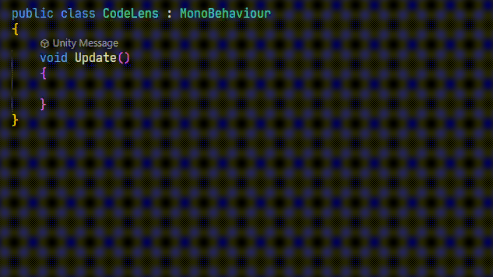
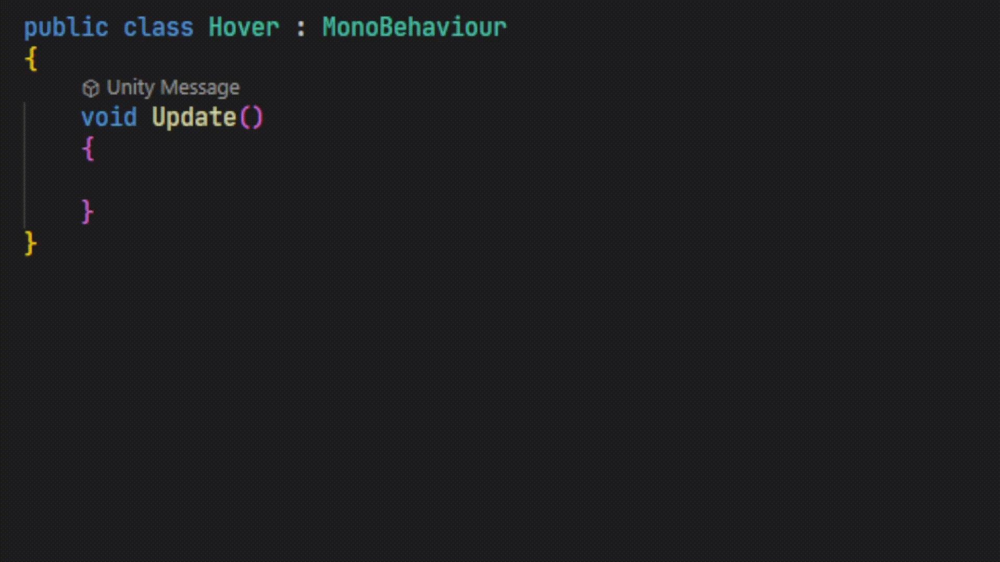
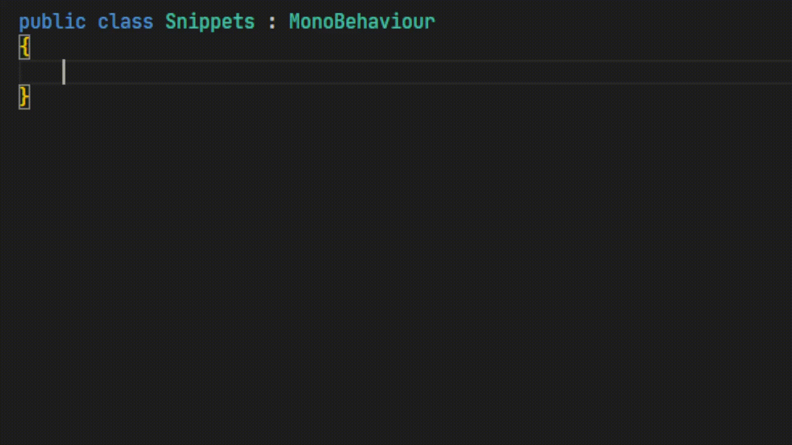
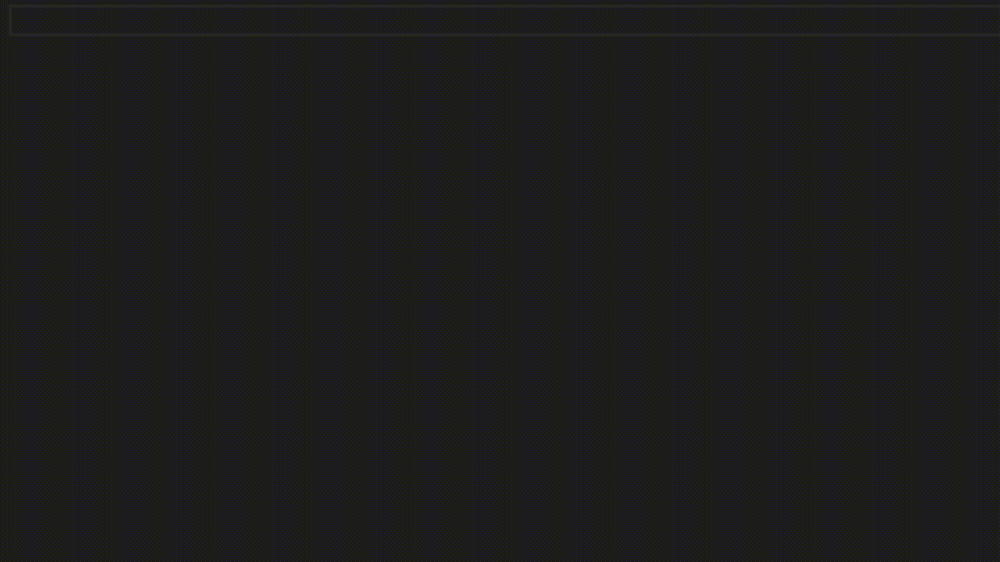
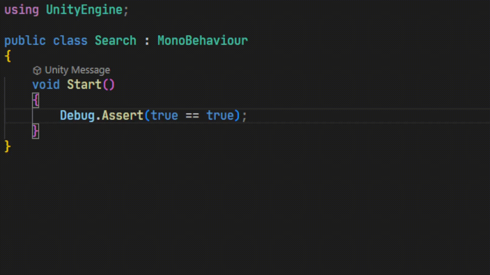
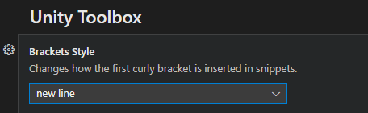

<h1>Unity Toolbox</h1>
A set of tools for VSCode & Unity

 
<h2>CodeLens for Unity Messages</h2>

 
<h2>Help on hover for Unity Messages</h2>

 
<h2>Context Sensitive Snippets</h2>

 
<h2>Script Templates</h2>

 
<h2>Documentation Search</h2>

 
<h2>Configurable Brackets Style</h2>
