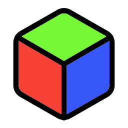

<h2><b><a href='https://assetstore.unity.com/packages/slug/282103'>📢 JUST RELEASED: My new project is live on the Unity Asset Store! Discover it now! 📢</a></b></h2>

<h1>Unity Toolbox</h1>

Awesome tools for VSCode & Unity

<h2>About</h2>
Unity Toolbox is a free and open source collection of game development tools for Unity.
  
All features are listed below.
   
Happy coding! ❤️
<h2>Features</h2>
<h3>Context-Aware Snippets for Unity Messages</h3>

<h3>CodeLens for Unity Messages</h3>

<h3>Documentation On Hover for Unity Messages</h3>

<h3>Coding Style Customization</h3>

<h3>Quick API Search</h3>

<h3>MonoBehaviour Usages</h3>

<h3>ScriptableObject Usages</h3>

<h3>File Templates Menu</h3>

<h3>Basic File Templates</h3>

<h3>DOTS File Templates</h3>

<h3>Editor File Templates</h3>

<h3>File Associations</h3>

<h2>Note</h2>
Unity Toolbox IS NOT made by Unity Technologies. 